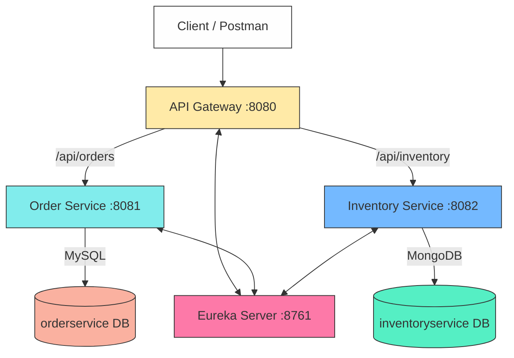

# 🧩 Spring Boot Microservices System — Order & Inventory

A beginner-friendly **microservices system** built using **Spring Boot**, featuring multiple independent services communicating via an **API Gateway** and registered through a **Service Discovery (Eureka)** server.

This project is based on the tutorial:  
[➡️ Building Your First Microservice System with Spring Boot: A Beginner’s Guide](https://dev.to/isaactony/building-your-first-microservice-system-with-spring-boot-a-beginners-guide-3b28)


## 🚀 Overview

This system demonstrates:
- Building microservices with **Spring Boot**
- Connecting each microservice to its own **database**
- Centralizing routing with an **API Gateway**
- Enabling **service discovery** using Eureka

Each service runs independently, communicating via HTTP and registered under Eureka.


## 🧱 System Components

| Service | Port | Description | Database |
|----------|------|-------------|-----------|
| **API Gateway** | `8080` | Routes client requests to the appropriate microservice | — |
| **Order Service** | `8081` | Handles product orders | MySQL |
| **Inventory Service** | `8082` | Manages inventory stock levels | MongoDB |
| **Eureka Server** | `8761` | Service registry for dynamic service discovery | — |


## 🗺️ Architecture Diagram




## 🧩 API Endpoints

All APIs are accessed via the API Gateway (port 8081 & 8082).

    Service	Method	        Endpoint	        Description
    Order Service	        POST/api/orders	    Create a new order
    Order Service	        GET/api/orders	    Retrieve all orders
    Inventory Service	    POST/api/inventory	Add a new inventory item
    Inventory Service	    GET/api/inventory	Retrieve all inventory items


## 🧪 Example JSON Payloads

### Create Order
```json
{
  "product": "Laptop",
  "quantity": 2,
  "price": 85000.0
}
```

### Create Inventory Item
```json
{
  "product": "Laptop",
  "quantity": 100
}
```

## ⚙️ Running the Project
### 🪄 Prerequisites

    Java 17
    Maven
    Docker (or local MySQL + MongoDB)
    Postman or cURL

## 🧾 Steps

### Clone the repository
```bash
git clone <your-repo-url>
cd springboot-microservices
```

### Start the databases (Docker recommended)
#### MySQL
```bash
docker run -d --name mysql-orders -e MYSQL_ROOT_PASSWORD=root \
  -e MYSQL_DATABASE=orderservice -p 3306:3306 mysql:8.0
```
#### MongoDB
```bash
docker run -d --name mongodb-inventory -e MONGO_INITDB_DATABASE=inventoryservice \
  -p 27017:27017 mongo:6.0
```

#### Start the Eureka Server
```bash
cd eureka-server
mvn spring-boot:run
```

#### Start the Order Service
```bash
cd ../order-service
mvn spring-boot:run
```

#### Start the Inventory Service
```bash
cd ../inventory-service
mvn spring-boot:run
```

#### Start the API Gateway
```bash
cd ../api-gateway
mvn spring-boot:run
```

## Test APIs via Postman

POST http://localhost:8081/api/orders

GET  http://localhost:8081/api/orders

POST http://localhost:8082/api/inventory

GET  http://localhost:8082/api/inventory


## 🧠 Concepts Demonstrated
- Microservices Communication via HTTP REST APIs
- Database per Service (MySQL + MongoDB)
- Service Discovery with Netflix Eureka
- Centralized Routing using Spring Cloud Gateway
- Loose Coupling & Scalability

## 📦 Folder Structure
```bash
springboot-microservices/
│
├── api-gateway/          # API Gateway
├── eureka-server/        # Service discovery
├── order-service/        # Handles orders (MySQL)
├── inventory-service/    # Manages inventory (MongoDB)
└── README.md
```

## 🧰 Technologies Used
    Java 17
    Spring Boot 3.2
    Spring Cloud 2023.0.x
    Spring Cloud Gateway
    Netflix Eureka
    MySQL / MongoDB
    Docker
    Maven

## 💡 Future Enhancements

✅ Add authentication (JWT + Spring Security)

✅ Integrate centralized config with Spring Cloud Config Server

✅ Add resilience with Resilience4j / Circuit Breakers

✅ Implement tracing and metrics with Sleuth + Zipkin

✅ Docker Compose setup for all services

## 📝 License & Contributions

This project is open-source under the MIT License.
Contributions, issues, and feature requests are welcome!

🚀 Built with ❤️ using Spring Boot Microservices


          
